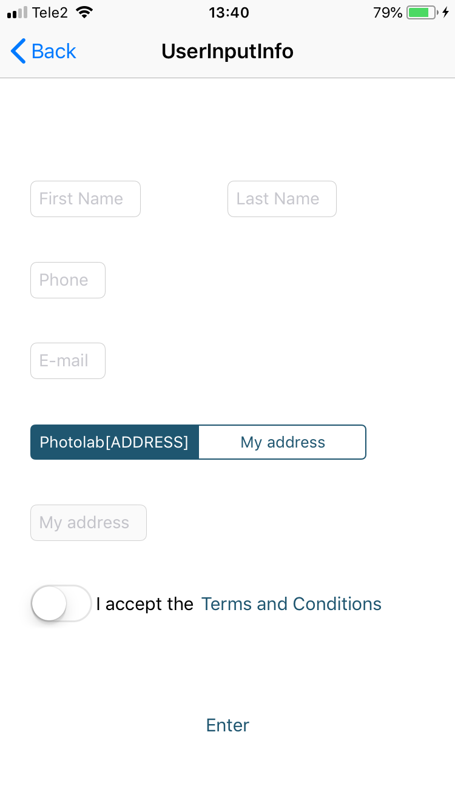
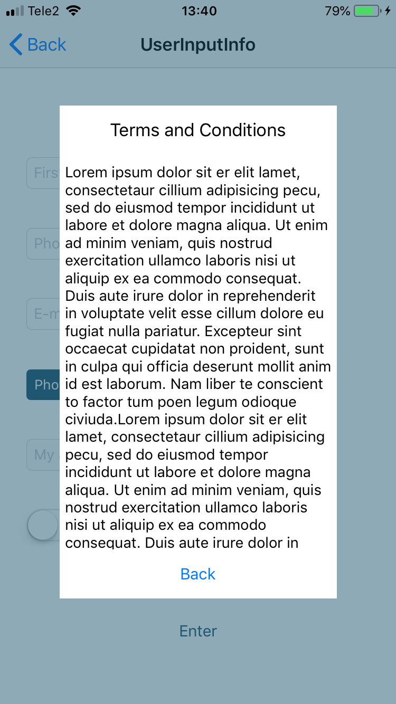

# Äpic iOS versioon  
  
## Eesmärk  
Arendada kliendile rakendus, mida saab kasutada nii Androidi kui ka iOSi platvormil. Rakendust saab kasutada piltide ilmutamise tellimiseks.  
  
## Kirjeldus  
Kasutaja saab rakenduse abil valida telefonist pilte, mida ta soovib saata ilmutamisse. Rakenduse abil saab pildid lõigata õigesse 2:3 suhtesse ning kasutajal on kontroll selle üle, millist pildi osa ta soovib säilitada. Lisaks saab mugavalt valida soovitud piltide koguseid.  
  
## Õpime Tallinna Ülikoolis Deigitehnoloogiate instituudis informaatika erialal. Projekt on loodud kursuse Tarkvaraarenduse praktika raames.  
  
## Kasutatud tehnoloogia  
  
Xcode 9.4, Adobe Photoshop CC 2018, Adobe Illustrator CC 2018, Github Desktop  
  
## Meeskond  
  
Veli Vaigur, Petrik Sarri, Martin Sõmer, Kalmer Roopa, Roland Kasenurm  
  
## Paigaldusjuhised  
  
Paigaldamiseks muud varianti hetkel ei ole kui tuleb kasutada Mac OSi. Seal installida läbi App Store'i Xcode arenduskeskkond, avada Äpic.xcodeproj Xcodega, ühendada iPhone arvutiga. Peale projekti avamist Xcode keskkonnas, tuleb ülemise rea vasakult poolelt valida iPhone simulaatori asemel reaalne arvutiga ühendautud iPhone seade. Peale seadme valimist vajutada valikunupust vasakul pool olevat nuppu, mis on play nupu kujuga. Seejärel hakatakse valitud seadmesse rakendust installima.  
  
## Litsents  
  
Litsents: https://opensource.org/licenses/MIT  
Projektis kasutatud pildi kärpimise teek: https://github.com/jvk75/UIImageCropper  
  
## Ekraanipildid  
  
Select Image             |  Crop Image
:-------------------------:|:-------------------------:
  |    
  
Filter Page             |  Filter Applied
:-------------------------:|:-------------------------:
  |    
  
Select Quantity             |  Cart
:-------------------------:|:-------------------------:
  |    
  
User Info             |  Terms and Conditions
:-------------------------:|:-------------------------:
  |  